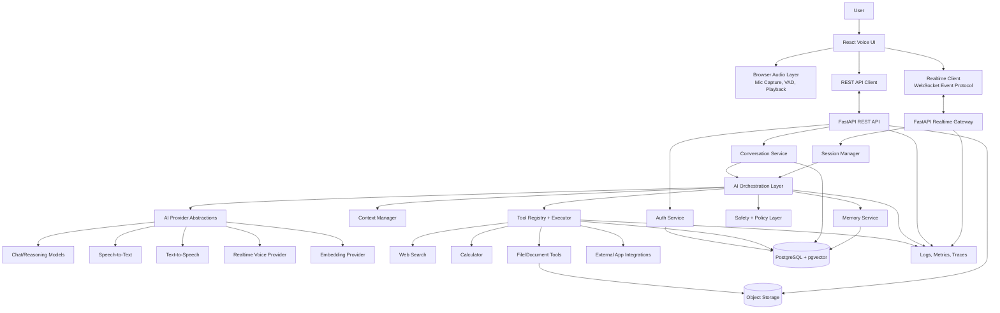
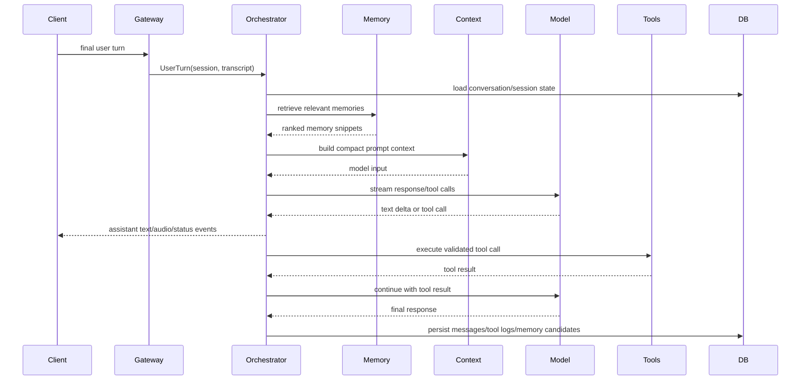

# Professional AI Voice Assistant — Architecture & Technical Blueprint

## 1. Executive Architecture Overview

This project should be built as a modular, production-grade voice-first assistant platform rather than a single chatbot application. The core design separates the user interface, realtime transport, backend APIs, AI orchestration, tools, memory, persistence, and infrastructure so each can evolve independently.

The recommended architecture is:

- **React + TypeScript frontend** for a polished web voice interface, transcript, settings, tool status, and memory controls.
- **FastAPI backend** for typed REST APIs, WebSocket realtime sessions, authentication, orchestration entry points, tool execution, and persistence.
- **Provider-agnostic AI layer** with explicit interfaces for chat/reasoning models, realtime voice models, speech-to-text, text-to-speech, embeddings, and tool calling.
- **PostgreSQL as the system of record**, with `pgvector` added when semantic retrieval is needed for long-term memory and document retrieval.
- **Redis only when justified by runtime needs**, initially for ephemeral session coordination, rate limiting, and pub/sub if multiple backend workers are used.
- **Tool/plugin registry** where tools declare metadata, schemas, permissions, confirmation requirements, execution handlers, and result contracts.
- **Memory subsystem** that treats short-term conversation state, session facts, long-term memory, and preferences as distinct data types with separate write policies.
- **Observability-first implementation** using structured logs, request/session IDs, tracing, metrics, and tool execution audit events.

The first implementation should be a small but real vertical slice: authenticated web app, voice/text conversation session, streaming response, database persistence, and clear extension points. Advanced memory, many tools, mobile apps, scheduled tasks, and multi-provider routing should come later without changing the foundational architecture.

---

## 2. Recommended Technology Stack

### Frontend

**Recommended:** React + TypeScript + Vite.

Supporting choices:

- **UI framework:** React with TypeScript.
- **Build tooling:** Vite for fast local development and simple production builds.
- **Styling:** Tailwind CSS plus a component system such as shadcn/ui or Radix primitives.
- **State management:** Zustand for client UI/session state; TanStack Query for REST data fetching and cache management.
- **Realtime:** Native WebSocket client initially; WebRTC later if direct low-latency bidirectional audio transport becomes necessary.
- **Audio capture:** Browser `MediaDevices.getUserMedia`, `AudioContext`, `AudioWorklet` for low-latency capture and optional client-side VAD.
- **Audio playback:** Web Audio API with queue management, interruption, and playback state tracking.
- **Testing:** Vitest, React Testing Library, Playwright.

Why this stack:

- React/TypeScript is mature, maintainable, widely understood, and well-suited to complex interactive UIs.
- Vite keeps setup lightweight while preserving production build quality.
- Browser-native audio APIs avoid unnecessary dependencies and allow precise control over microphone and playback behavior.
- WebSocket is simpler than WebRTC for the initial product and sufficient for streaming text/events and chunked audio. WebRTC can be introduced behind the same realtime client abstraction later.

### Backend

**Recommended:** Python + FastAPI.

Supporting choices:

- **Framework:** FastAPI.
- **Runtime server:** Uvicorn locally; Gunicorn/Uvicorn workers in production.
- **Async:** Native `asyncio` for streaming provider calls, WebSockets, and concurrent tool execution.
- **Validation:** Pydantic v2 for settings, API contracts, tool schemas, and provider events.
- **Database access:** SQLAlchemy 2.x async ORM/core plus Alembic migrations.
- **Authentication:** JWT/session-token based auth initially, with OAuth/OIDC support later.
- **Background jobs:** Start with FastAPI background tasks for non-critical work; add Celery/RQ/Arq only when job durability or scheduled tasks require it.
- **Testing:** Pytest, pytest-asyncio, httpx test client, respx/aioresponses for provider mocks.

Why FastAPI:

- Strong typing and OpenAPI generation fit the project’s long-term maintainability goals.
- Async support is a practical match for streaming AI providers, WebSockets, tool calls, and database access.
- Python has strong AI ecosystem support while still being production-ready for API services.

### AI Layer

**Recommended:** A provider-agnostic internal interface with adapters for specific model and voice providers.

Core interfaces:

- `ChatModelProvider`: streaming conversational output and tool calls.
- `RealtimeVoiceProvider`: bidirectional audio/text event sessions where supported.
- `SpeechToTextProvider`: streaming and batch transcription.
- `TextToSpeechProvider`: streaming and batch synthesis.
- `EmbeddingProvider`: vector embeddings for memory and documents.
- `Moderation/SafetyProvider`: optional policy checks.

Two viable approaches:

1. **Unified realtime voice model path**
   - Audio streams directly to a realtime AI provider.
   - Provider handles turn detection, transcription, reasoning, and audio output.
   - Lowest latency and most natural interruption semantics.
   - Higher provider coupling and less control over intermediate stages.

2. **Composed STT → LLM → TTS path**
   - Audio transcribed by STT, text sent to LLM, response synthesized by TTS.
   - More modular, easier provider replacement, easier debugging.
   - Higher latency and more work to support natural barge-in.

**Chosen strategy:** Support both through the same orchestration contract, but implement the composed pipeline first unless a single realtime provider is explicitly selected for the MVP. The composed pipeline is more debuggable and provider-flexible. The frontend/backend realtime event protocol should be designed so a realtime voice provider can be added later without rewriting UI or orchestration.

### Database

**Recommended:** PostgreSQL as primary database.

Use PostgreSQL for:

- users and identities
- user settings and preferences
- conversations
- messages
- session metadata
- memory records
- tool execution logs
- uploaded file metadata
- audit events
- application state

**Vector search:** Use `pgvector` inside PostgreSQL when long-term semantic memory and document retrieval are implemented. A separate vector database is not necessary at the beginning because it adds operational complexity. Dedicated vector stores can be considered later if scale, indexing requirements, tenant isolation, or retrieval latency exceed what PostgreSQL can comfortably handle.

### Caching, Redis, and Queues

Do not add infrastructure without a clear need.

Initial usage:

- **No durable queue required for Phase 1.** Synchronous request/session handling is enough.
- **Redis optional in Phase 2/3** for rate limiting, realtime session coordination across workers, short-lived audio/session state, and pub/sub.
- **Durable queue later** for reminders, scheduled tasks, long file processing, email/calendar integrations, and retryable external actions.

Recommended queue path:

- Start: FastAPI background tasks for non-critical post-processing.
- Next: Arq or RQ with Redis for lightweight Python async jobs.
- Later: Celery, Temporal, or managed cloud queues when workflows become durable, multi-step, or business-critical.

---

## 3. High-Level Architecture Diagram



### Major Components

- **Voice/UI Layer:** Captures microphone input, renders assistant state, plays streaming audio, shows transcript, exposes interrupt controls, and manages user settings.
- **Realtime Communication Layer:** Maintains a bidirectional session for audio chunks, transcript deltas, assistant events, tool events, response deltas, errors, and heartbeat messages.
- **Backend API Layer:** Handles authentication, REST resources, WebSocket session lifecycle, rate limits, and coordination with orchestration.
- **AI Orchestration Layer:** Converts user input into model calls, tool calls, memory retrieval, context updates, and streamed assistant output.
- **Model/Voice Services:** Provider adapters for text, speech, realtime, embeddings, and safety checks.
- **Memory System:** Retrieves and writes appropriate session and long-term memories without blindly saving every message.
- **Tool System:** Registers tools and executes validated, permission-aware tool calls outside the core orchestration logic.
- **External Services:** Search APIs, file storage, calendars, email, developer systems, notes, reminders, and future integrations.
- **Database/Storage:** Durable system state in PostgreSQL; binary uploads and derived artifacts in object storage.

---

## 4. Detailed Component Architecture

### Frontend Components

- `VoiceSessionPage`: Main assistant experience.
- `VoiceOrb` or `AssistantPresence`: Visual state for idle, listening, thinking, speaking, interrupted, and error.
- `MicController`: Permission requests, device selection, microphone stream lifecycle.
- `AudioCaptureService`: AudioWorklet-based capture, chunking, optional local VAD.
- `PlaybackQueue`: Streaming audio queue with cancel/interrupt support.
- `RealtimeClient`: WebSocket connection, reconnect, heartbeat, event normalization.
- `TranscriptPanel`: User and assistant transcript with partial/final markers.
- `ToolActivityPanel`: Shows tool calls, progress, permissions, and results summary.
- `ConversationHistory`: Previous conversations and session resume.
- `SettingsPanel`: Model, voice, microphone, playback, privacy, and memory settings.
- `MemoryControls`: View, edit, disable, or delete saved memories.
- `ErrorBanner/Toast`: Recoverable and blocking errors.

### Backend Components

- `api/routes`: REST endpoints for auth, users, conversations, messages, memories, files, tools, health.
- `realtime/gateway`: WebSocket endpoint and event router.
- `realtime/session_manager`: Tracks active sessions, stream states, cancellation tokens, and reconnection windows.
- `assistant/orchestrator`: Main workflow for input → context → model/tool/memory → response.
- `assistant/context`: Builds compact model context from recent messages, summaries, memory, and tool results.
- `assistant/providers`: Interfaces and provider adapters.
- `tools/registry`: Tool discovery and metadata.
- `tools/executor`: Permission checks, validation, execution, timeouts, logging, and result normalization.
- `memory/service`: Retrieval, ranking, write policy, updates, deletions.
- `db`: SQLAlchemy models, repositories, migrations.
- `security`: auth, authorization, rate limiting, confirmation flows, redaction.
- `observability`: structured logs, traces, metrics, request IDs.

---

## 5. Voice Pipeline Architecture

### Target Experience

The interaction should feel like a live conversation:

1. User starts speaking.
2. UI immediately shows listening and partial speech activity.
3. Audio streams continuously to the backend or realtime provider.
4. Partial transcripts appear quickly where supported.
5. Turn detection identifies when the user has likely finished.
6. The assistant begins generating as soon as enough input is available.
7. Text and/or audio response streams back incrementally.
8. User can interrupt while the assistant is speaking.
9. The interrupted response stops quickly and the new user turn takes priority.

### Pipeline Steps

#### Microphone Input

- Browser requests microphone permission via `getUserMedia`.
- User can select input device in settings.
- Capture PCM audio with `AudioWorklet` for reliable low-latency chunks.
- Encode chunks in a provider-compatible format, preferably PCM16 or Opus depending on transport/provider.
- Attach sequence numbers and timestamps to chunks.

#### Speech Detection

Use a layered approach:

- **Client-side VAD:** Detects likely speech start/end for responsive UI and to avoid streaming unnecessary silence.
- **Server/provider-side VAD:** Final turn detection authority because it can use provider semantics and backend timing.
- **Manual push-to-talk fallback:** Useful when browser VAD is unreliable or the environment is noisy.

#### Speech-to-Text / Realtime Processing

Two supported modes:

- **Composed mode:** Client audio → backend → STT streaming → transcript events → orchestration.
- **Realtime provider mode:** Client audio → backend relay or direct ephemeral provider session → provider emits transcript/model/audio events.

Backend should normalize both modes into internal events:

- `input_audio.started`
- `input_audio.chunk`
- `transcript.partial`
- `transcript.final`
- `turn.detected`
- `assistant.response.started`
- `assistant.text.delta`
- `assistant.audio.delta`
- `assistant.response.completed`
- `assistant.interrupted`
- `error`

#### AI Processing

- Once a final transcript or stable utterance is available, the session manager sends a `UserTurn` to the orchestrator.
- Orchestrator retrieves relevant memory, builds context, invokes the model, handles tool calls, and streams output events.
- For low latency, response generation should stream text as soon as possible.

#### Text-to-Speech / Audio Output

- If using composed mode, stream generated text sentence-by-sentence or phrase-by-phrase to TTS.
- TTS emits audio chunks to the frontend.
- Frontend playback queue starts playback before the full response is complete.
- Text transcript should continue updating even if audio playback fails.

#### Interruption / Barge-In

- Frontend detects speech while assistant audio is playing.
- It immediately lowers or stops playback locally.
- It sends `interrupt` to backend with active response ID.
- Backend cancels model/TTS streams using cancellation tokens.
- Assistant response is marked `interrupted` in conversation state.
- New user audio turn starts immediately.

#### Silence and Turn Detection

- Use configurable silence thresholds, such as 500–900ms after speech for natural turn-end detection.
- Avoid ending turns too early by considering speech confidence, recent speech duration, and punctuation from partial transcripts.
- Provide a user setting for turn sensitivity.
- Use server timestamps to handle network jitter.

#### Connection Failures and Reconnect

- WebSocket heartbeat every 15–30 seconds.
- If disconnected, frontend enters `reconnecting` state and buffers a small amount of current transcript/audio metadata, not unlimited raw audio.
- Backend keeps session resumable for a short TTL, such as 60–120 seconds.
- On reconnect, client sends last received event ID; backend replays missed durable events where possible.
- If audio stream cannot be resumed safely, UI tells the user the last utterance may need repeating.

#### Latency Reduction

- Keep WebSocket connection warm.
- Stream audio chunks rather than waiting for full recordings.
- Use client VAD to detect speech start immediately.
- Start LLM streaming as soon as final user turn is detected.
- Start TTS on stable phrases instead of full response completion.
- Avoid unnecessary database writes in the critical response path; persist asynchronously where safe.
- Cache user preferences and active session state.
- Keep model context compact.

#### Handling Simultaneous Audio Events

Use a session-level state machine:

- `idle`
- `listening`
- `transcribing`
- `thinking`
- `speaking`
- `interrupted`
- `error`
- `reconnecting`

Every audio event carries:

- session ID
- turn ID
- response ID when applicable
- monotonic sequence number
- timestamp
- event type

Late events from canceled responses are ignored if their response ID is no longer active.

---

## 6. AI Orchestration Architecture

### Responsibilities

The orchestration layer owns assistant behavior but not low-level tools or provider SDK details. It is responsible for:

- Receiving normalized user turns.
- Loading conversation and session state.
- Retrieving relevant memory.
- Building model context.
- Applying safety and security policy.
- Invoking model providers.
- Handling tool call requests.
- Executing tools through the tool executor.
- Feeding tool results back into the model.
- Streaming response events.
- Persisting messages, summaries, memory candidates, and tool history.

### Internal Flow



### Recommended Modules

- `AssistantOrchestrator`: top-level workflow coordinator.
- `ConversationStateService`: session and conversation load/save.
- `ContextBuilder`: prompt and context assembly.
- `ModelRouter`: selects provider/model based on capability, user settings, availability, and cost policies.
- `ToolCallController`: validates and executes model-requested tools.
- `MemoryCoordinator`: retrieves memories before generation and evaluates memory writes after turns.
- `SafetyPolicyEngine`: prompt-injection boundaries, tool permission checks, content filters, and confirmation decisions.
- `ResponseStreamer`: emits normalized events to realtime gateway.

### Provider Abstraction

Provider adapters should return normalized streaming events rather than exposing raw SDK objects throughout the application. This prevents provider lock-in and simplifies testing.

Example event classes:

- `ModelTextDelta`
- `ModelToolCallRequested`
- `ModelCompleted`
- `ModelRefusal`
- `ModelError`
- `AudioDelta`
- `TranscriptDelta`

---

## 7. Tool / Plugin Architecture

### Tool Contract

Every tool should define:

- **Unique name:** stable identifier, such as `web.search` or `calculator.evaluate`.
- **Display name:** human-readable UI label.
- **Description:** model-facing and user-facing descriptions may differ.
- **Input schema:** Pydantic model and JSON Schema.
- **Output schema:** normalized result contract.
- **Permission class:** read-only, write, destructive, sensitive, external side effect.
- **Confirmation policy:** never, always, or conditional.
- **Execution handler:** async function/class that runs the tool.
- **Timeout and retry policy:** per tool.
- **Audit policy:** what to log and what to redact.
- **Error mapping:** safe user-facing error messages.

### Permission Classes

- **READ:** Search, retrieve, calculate, inspect files, summarize documents.
- **WRITE:** Create notes, add reminders, draft emails, update settings.
- **DESTRUCTIVE:** Delete files, send email, publish content, perform purchases, modify external systems irreversibly.
- **SENSITIVE:** Access private documents, email, calendar, location, credentials, financial or health-related data.

WRITE, DESTRUCTIVE, and some SENSITIVE actions require confirmation and authorization.

### Tool Execution Flow

1. Model requests a tool by name and JSON arguments.
2. Tool registry resolves metadata and schema.
3. Tool executor validates arguments with Pydantic.
4. Permission engine checks user, tool, scope, and confirmation requirements.
5. If confirmation is needed, assistant pauses and asks user.
6. Executor runs tool with timeout, cancellation, and logging.
7. Tool returns normalized result.
8. Result is persisted in tool history.
9. Orchestrator sends summarized result back to model.
10. UI receives tool activity events.

### Adding a New Tool

A developer adds a new tool package/module that exports a `ToolDefinition` and handler. The registry discovers it through explicit registration or package entry points. The orchestrator does not change; it only sees the tool metadata and result contract.

---

## 8. Memory Architecture

### Short-Term Memory

Scope: current model context.

Stores:

- recent user/assistant messages
- current turn information
- active tool results
- active response state

Does not require special persistence beyond messages and session state.

### Session Memory

Scope: current conversation session.

Stores:

- temporary goals
- constraints for the current task
- files currently being discussed
- intermediate decisions
- session summary

Session memory can be persisted with the conversation but should not automatically become long-term memory.

### Long-Term Memory

Scope: future conversations.

Stores only durable, useful, user-relevant facts such as:

- user-approved personal preferences
- stable project details
- recurring goals
- persistent constraints
- facts the user explicitly asks the assistant to remember

Should not store:

- every conversation message
- transient moods or one-off statements
- secrets, passwords, tokens, API keys
- highly sensitive information unless explicitly supported, encrypted, justified, and user-controlled
- unverified inferred facts presented as certain

### User Preferences

Preferences are structured settings, not freeform memories:

- voice selection
- response verbosity
- interaction mode
- preferred units/language
- memory enabled/disabled
- tool permission defaults
- accessibility settings

### Memory Retrieval

Retrieve memory when:

- starting a session
- the user asks a personal/contextual question
- the current query semantically matches known memories
- the tool or task needs preference context

Do not retrieve all memories for every turn. Use lightweight filters first, then vector similarity when appropriate.

### Memory Writing

Write memory when:

- the user explicitly says to remember something
- a high-confidence durable preference emerges and policy allows asking for confirmation
- user edits memory manually

A memory candidate pipeline should classify, deduplicate, and optionally ask confirmation before saving.

### Updating and Deleting Memory

- Memories have source, confidence, timestamps, version history, and optional expiration.
- Contradictory new facts should update or supersede old memories rather than creating duplicates.
- Users can view, edit, disable, export, and delete memory.
- Deletions should remove vector embeddings and derived summaries.

---

## 9. Conversation Context Management

Use a layered context strategy:

1. **System and developer policy:** Small stable instruction set.
2. **User preferences:** Structured, minimal, relevant preferences.
3. **Retrieved memories:** Top-ranked, relevant, cited internally.
4. **Conversation summary:** Running summary of older turns.
5. **Recent messages:** Last N turns preserved verbatim.
6. **Active tool results:** Only relevant outputs, summarized when large.
7. **Current user turn:** Full current request/transcript.

Long conversations should not push every old message into the model. Instead:

- Keep the last several turns verbatim.
- Summarize older content when token thresholds are reached.
- Preserve decisions, constraints, open tasks, file references, and unresolved questions.
- Store large tool outputs as artifacts and pass concise summaries plus references.
- Refresh summaries incrementally rather than rewriting huge context repeatedly.
- Use retrieval only when relevant to the current turn.

---

## 10. Database Design Overview

Recommended core tables:

- `users`: identity, auth provider IDs, account state.
- `user_settings`: voice, model, privacy, UI preferences.
- `conversations`: title, owner, timestamps, archived status.
- `conversation_sessions`: realtime session metadata and lifecycle.
- `messages`: role, content, transcript confidence, status, token counts.
- `message_parts`: text, audio reference, tool call, file reference, structured content.
- `conversation_summaries`: rolling summaries and covered message ranges.
- `memories`: structured long-term memories, category, confidence, status.
- `memory_embeddings`: embedding vector, provider, dimensions, memory ID.
- `tools`: registered tool metadata snapshot/version.
- `tool_executions`: tool name, arguments hash/redacted args, status, latency, result summary.
- `files`: upload metadata, storage URI, mime type, scan status.
- `file_chunks`: extracted text chunks and optional embeddings.
- `audit_events`: security-relevant actions and confirmations.
- `rate_limit_events`: optional if not fully handled by Redis.

Use object storage for audio recordings, uploaded documents, generated files, and large artifacts. Store references and metadata in PostgreSQL.

---

## 11. Frontend Architecture

### Pages

- `/`: landing or redirect to assistant.
- `/assistant`: main voice assistant session.
- `/conversations/:id`: conversation history and replay.
- `/settings`: user, voice, model, privacy, and integrations.
- `/memory`: memory review and deletion.
- `/tools`: tool permissions and connected integrations.

### UI State

Separate state into:

- **Connection state:** disconnected, connecting, connected, reconnecting.
- **Voice state:** idle, listening, transcribing, thinking, speaking, interrupted.
- **Conversation state:** messages, partial transcripts, active response, active tools.
- **User settings state:** preferences and device settings.
- **Error state:** recoverable vs blocking errors.

### Professional UI Behavior

- Always show what the assistant is doing.
- Use progressive disclosure for tool activity.
- Make interrupt obvious and fast.
- Show partial transcripts with clear finalization.
- Provide keyboard fallback for accessibility.
- Allow text-only mode if microphone fails.
- Clearly indicate when memory is used or saved.
- Surface connection and provider issues without exposing internals.

---

## 12. Backend Architecture

### API Surface

REST endpoints:

- `POST /auth/login`
- `POST /auth/logout`
- `GET /me`
- `GET/POST /conversations`
- `GET /conversations/{id}`
- `GET /conversations/{id}/messages`
- `GET/PUT /settings`
- `GET/POST/PATCH/DELETE /memories`
- `GET /tools`
- `PATCH /tools/{name}/permissions`
- `POST /files`
- `GET /health`
- `GET /ready`

Realtime endpoint:

- `WS /realtime/sessions/{session_id}`

Realtime events should use versioned schemas, for example `event_type`, `event_id`, `session_id`, `turn_id`, `payload`, `timestamp`.

### Backend Boundaries

- Routes do not contain business logic.
- Services own use cases.
- Repositories own persistence.
- Provider adapters own external SDK/API details.
- Tool implementations live outside orchestration.
- Security policies are reusable and centrally enforced.

---

## 13. Security Architecture

### Authentication and Authorization

- Start with secure email/password or OAuth depending on product needs.
- Store password hashes using Argon2id if passwords are supported.
- Use HTTP-only secure cookies or short-lived access tokens plus refresh tokens.
- Every conversation, memory, file, and tool execution is scoped to a user.
- Realtime sessions require authentication and ownership checks.

### Secrets and API Keys

- Provider API keys are server-side only.
- Use environment variables locally and managed secret storage in production.
- Never expose provider keys to the browser except short-lived provider-specific ephemeral tokens if direct provider WebRTC is intentionally used.
- Redact secrets in logs.

### Tool Permissions

READ actions can run with lower friction but still require authorization.
WRITE actions require explicit user permission scopes.
DESTRUCTIVE actions require confirmation at execution time.
Sensitive actions require scope checks and may require re-authentication.

### Prompt Injection Protection

- Treat tool outputs, web pages, files, and retrieved documents as untrusted data.
- Never allow untrusted content to override system/developer instructions.
- Use tool-specific output wrappers that label content as external/untrusted.
- Restrict available tools by user permissions and task context.
- Validate tool arguments independently of model output.

### File Upload Security

- Enforce file size and type limits.
- Store uploads outside the web root.
- Virus/malware scan in production.
- Extract text in sandboxed workers when possible.
- Do not execute uploaded content.
- Strip or ignore active content in documents.

### Rate Limiting

- Per-user and per-IP request limits.
- Separate limits for expensive AI calls, audio sessions, file processing, and tools.
- Backoff and clear user messaging when limits are hit.

---

## 14. Error-Handling Strategy

- **AI provider failure:** Retry idempotent transient failures, fall back to another provider when configured, otherwise explain that the model is temporarily unavailable.
- **Network failure:** Frontend reconnects with last event ID; backend resumes session if within TTL.
- **Microphone failure:** Offer troubleshooting and text input fallback.
- **Audio playback failure:** Continue transcript display and offer retry/replay.
- **Tool failure:** Return safe, concise error to model/user; log detailed internal error with correlation ID.
- **Timeout:** Cancel operation, mark status timeout, provide retry option.
- **Malformed tool output:** Reject result, log schema error, ask model to continue without invalid data if possible.
- **Database failure:** Avoid pretending persistence succeeded; preserve in-memory active response when possible and notify user if history may not save.
- **Authentication failure:** Close realtime session and redirect/re-authenticate.
- **Lost realtime connection:** Reconnect, replay missed durable events, ask user to repeat only if audio turn was lost.
- **Rate limits:** Stop expensive operation before provider call when possible and show cooldown/upgrade guidance.

---

## 15. Observability Strategy

### Logging

Use structured JSON logs with:

- `request_id`
- `session_id`
- `conversation_id`
- `turn_id`
- `response_id`
- `user_id` or redacted stable hash
- event type
- latency
- provider
- model
- tool name
- status
- error code

Do not log raw secrets, full private file contents, or sensitive tool arguments.

### Metrics

Track:

- WebSocket connection count
- audio chunk receive latency
- time to first transcript
- time to final transcript
- time to first model token
- time to first audio byte
- total response latency
- interruption latency
- provider error rate
- tool success/failure rate
- memory retrieval latency
- database latency

### Tracing

Distributed traces should follow a turn across:

frontend event → realtime gateway → orchestrator → memory retrieval → model call → tool call → TTS → response stream.

### Health Checks

- `/health`: process alive.
- `/ready`: database reachable, migrations compatible, required providers configured.
- Optional provider health probes that do not run expensive model calls frequently.

### Debugging “The assistant heard me but never answered”

Developers should inspect by `session_id` and `turn_id`:

1. Did the frontend send audio chunks?
2. Did the backend receive them?
3. Was a final transcript produced?
4. Did turn detection fire?
5. Did the orchestrator start?
6. Did memory retrieval or context building fail?
7. Did the model call start?
8. Was a tool call pending confirmation?
9. Did streaming events leave the backend?
10. Did the frontend receive but fail to render/play them?

The trace waterfall should make the stuck stage obvious.

---

## 16. Testing Strategy

### Unit Tests

- Context builder token budgeting.
- Tool schema validation.
- Permission decisions.
- Memory write classification.
- Provider event normalization.
- Realtime state machine transitions.

### Integration Tests

- API routes with test database.
- WebSocket session lifecycle.
- Orchestrator with fake model and fake tools.
- Memory retrieval with seeded data.
- File upload metadata and validation.

### API Tests

- Auth required for private resources.
- User isolation.
- Invalid payload validation.
- Rate limit behavior.
- Conversation/message CRUD.

### Tool Tests

- Each tool has schema tests, permission tests, success tests, timeout tests, error mapping tests, and redaction tests.
- External APIs should be mocked in CI.
- Limited real-service smoke tests can run manually or nightly with test credentials.

### AI Orchestration Tests

Mock model providers with deterministic event streams:

- simple answer
- tool call and continuation
- tool error recovery
- interruption cancellation
- memory retrieval inclusion
- long-context compression

### Memory Tests

- Does not save every message.
- Saves explicit “remember this” requests.
- Deduplicates similar memories.
- Handles correction/deletion.
- Retrieval respects user ownership and relevance thresholds.

### Frontend Tests

- Component rendering.
- Voice state transitions.
- Transcript updates.
- Tool activity display.
- Settings forms.
- Error banners.
- WebSocket reconnect behavior with mocked server.

### Realtime / Voice Tests

- Simulated audio chunk stream.
- Partial and final transcript events.
- Playback queue cancellation.
- Barge-in handling.
- Lost connection recovery.
- Event ordering and stale response IDs.

### End-to-End Tests

Use Playwright with mocked backend/provider events for deterministic CI. Add optional manual or nightly tests against real AI/voice providers to validate integration health and latency.

---

## 17. Complete Repository Structure

```text
Ai-Assistant/
  README.md
  .env.example
  docker-compose.yml
  docs/
    architecture/
      technical-blueprint.md
      adr/
    api/
    operations/
  apps/
    web/
      package.json
      vite.config.ts
      src/
        app/
        pages/
        components/
          voice/
          conversation/
          settings/
          tools/
          memory/
          common/
        hooks/
        services/
          realtime/
          audio/
          api/
        stores/
        styles/
        types/
        test/
  services/
    api/
      pyproject.toml
      alembic.ini
      app/
        main.py
        config/
        api/
          routes/
          dependencies.py
        realtime/
          gateway.py
          events.py
          session_manager.py
        assistant/
          orchestrator.py
          context.py
          state.py
          streaming.py
          safety.py
        providers/
          base.py
          chat/
          speech_to_text/
          text_to_speech/
          realtime_voice/
          embeddings/
        tools/
          base.py
          registry.py
          executor.py
          permissions.py
          implementations/
        memory/
          service.py
          retrieval.py
          writing.py
          summarization.py
        db/
          models/
          repositories/
          migrations/
          session.py
        security/
          auth.py
          authorization.py
          rate_limits.py
          redaction.py
        observability/
          logging.py
          metrics.py
          tracing.py
        files/
        schemas/
      tests/
        unit/
        integration/
        realtime/
        tools/
  packages/
    shared-types/
      package.json
      src/
    event-schemas/
      schemas/
  scripts/
    dev.sh
    test.sh
    lint.sh
  infra/
    docker/
    terraform/
    k8s/
```

For the current planning step, only this architecture document should be added. Application files should be created during implementation phases.

---

## 18. Development Workflow and Environments

### Local Development

- Docker Compose for PostgreSQL and optional Redis.
- Backend runs with hot reload via Uvicorn.
- Frontend runs via Vite dev server.
- `.env.local` for local secrets, ignored by Git.
- `.env.example` documents required configuration without secret values.
- Local fake providers available for deterministic development without spending model credits.

### Testing Environment

- Ephemeral test PostgreSQL database.
- Provider APIs mocked by default.
- Deterministic fixtures for transcripts, model streams, tool calls, and TTS chunks.
- CI runs formatting, linting, type checks, unit tests, integration tests, and Playwright tests.

### Production Environment

- HTTPS everywhere.
- Managed PostgreSQL with backups and encryption.
- Managed Redis only when needed.
- Object storage for files/audio artifacts.
- Secrets in managed secret store.
- Horizontal backend replicas behind load balancer.
- Sticky sessions or shared session state for WebSockets if needed.
- Centralized logs, metrics, traces, and error tracking.

### Configuration

Use typed settings loaded from environment variables:

- `APP_ENV`
- `DATABASE_URL`
- `REDIS_URL`
- `SECRET_KEY`
- `AUTH_*`
- `AI_PROVIDER_*`
- `STT_PROVIDER_*`
- `TTS_PROVIDER_*`
- `EMBEDDING_PROVIDER_*`
- `OBJECT_STORAGE_*`
- `RATE_LIMIT_*`
- `LOG_LEVEL`
- `SENTRY_DSN` or equivalent

Secrets must never be committed.

---

## 19. Scalability Plan

### 1 User

- Single FastAPI process.
- Local PostgreSQL.
- No Redis required.
- Mock or single provider integration.
- File storage can be local in development.

### 100 Users

- Managed PostgreSQL.
- Multiple backend workers.
- Redis for rate limiting and session coordination.
- Object storage for uploads/audio.
- Provider timeout/retry policies.
- Basic metrics and error tracking.
- WebSocket-aware load balancing, potentially sticky sessions.

### 1,000+ Users

- Horizontally scaled API/realtime services.
- Separate worker service for long-running tools and file processing.
- Redis or pub/sub for active session coordination.
- Read replicas if conversation/history reads become heavy.
- Queue-based durable jobs for scheduled tasks and integrations.
- Provider routing/fallback across models and vendors.
- Cost controls, quotas, and usage metering.
- Dedicated vector database only if pgvector becomes a retrieval bottleneck.

### Likely Bottlenecks

- AI provider latency and rate limits.
- TTS streaming latency.
- WebSocket connection count per worker.
- Database writes for high-frequency event logging.
- Long document processing.
- Memory/vector retrieval as data grows.
- Tool integrations with slow third-party APIs.

---

## 20. Future Feature Support

This architecture supports future expansion through stable boundaries:

- **More AI models:** Add provider adapters behind existing interfaces.
- **More voice providers:** Add STT/TTS/realtime adapters without changing UI state model.
- **More tools:** Register new tool definitions and handlers.
- **Integrations:** Add OAuth scopes, tool permission classes, and integration repositories.
- **Richer memory:** Improve retrieval/writing service and embeddings without changing conversation UI.
- **User accounts:** Already central to data ownership and permissions.
- **Multiple devices:** Sessions and conversations are server-owned and can sync across clients.
- **Mobile/desktop clients:** Reuse REST and realtime event protocols.
- **Automation and scheduled tasks:** Add durable queue/workflow engine and scheduled tool triggers.
- **Advanced permissions:** Extend permission engine and confirmation policies.

---

## 21. Architecture Decision Records

### ADR 1: Use React + TypeScript for the Frontend

- **Decision:** Build the web client with React, TypeScript, and Vite.
- **Alternatives considered:** Next.js, SvelteKit, Vue, plain JavaScript.
- **Why chosen:** React/TypeScript offers mature tooling, strong typing, broad ecosystem support, and excellent suitability for realtime interactive UI.
- **Advantages:** Maintainable components, strong developer familiarity, good testing ecosystem.
- **Disadvantages:** Requires explicit routing/data architecture; not as batteries-included as Next.js.
- **Future migration path:** Can move to Next.js if server-side rendering, app routing, or integrated deployment becomes important.

### ADR 2: Use FastAPI for the Backend

- **Decision:** Use Python FastAPI for API and realtime backend services.
- **Alternatives considered:** Node/NestJS, Go, Django, Rust.
- **Why chosen:** FastAPI provides async support, type-driven schemas, OpenAPI generation, and strong AI ecosystem compatibility.
- **Advantages:** Productive, testable, typed, good streaming support.
- **Disadvantages:** Python concurrency requires discipline for CPU-bound work; WebSocket scaling requires careful deployment.
- **Future migration path:** Split high-throughput realtime relay or CPU-heavy processing into Go/Rust services if needed.

### ADR 3: Start with WebSocket Realtime Transport

- **Decision:** Use WebSocket as the initial realtime client/backend transport.
- **Alternatives considered:** WebRTC, Server-Sent Events, polling.
- **Why chosen:** WebSocket is simpler to implement and sufficient for bidirectional event, transcript, text, and chunked audio streaming.
- **Advantages:** Easier debugging, standard backend support, good enough for early voice pipeline.
- **Disadvantages:** WebRTC can be better for ultra-low-latency audio and network adaptation.
- **Future migration path:** Add WebRTC transport behind the same frontend `RealtimeClient` and backend event protocol.

### ADR 4: Use Provider-Agnostic AI Interfaces

- **Decision:** Hide AI providers behind internal chat, realtime voice, STT, TTS, embedding, and safety interfaces.
- **Alternatives considered:** Directly integrate a single provider SDK throughout the codebase.
- **Why chosen:** Long-term product requirements include replacing providers and adding models.
- **Advantages:** Testability, portability, fallback support, lower coupling.
- **Disadvantages:** Requires adapter maintenance and may not expose every provider-specific feature immediately.
- **Future migration path:** Add capability flags and provider-specific extension hooks for advanced features.

### ADR 5: Use PostgreSQL as Primary Database

- **Decision:** Use PostgreSQL for durable relational state.
- **Alternatives considered:** MongoDB, SQLite-only, managed document databases.
- **Why chosen:** Conversations, users, permissions, tool logs, and memory metadata are relational and benefit from transactional integrity.
- **Advantages:** Reliable, mature, scalable, supports JSON and vector extension.
- **Disadvantages:** Requires migrations and schema management.
- **Future migration path:** Add read replicas, partitioning, or specialized stores as scale demands.

### ADR 6: Use pgvector Before a Dedicated Vector Database

- **Decision:** Use pgvector for semantic memory/document retrieval when needed.
- **Alternatives considered:** Pinecone, Weaviate, Milvus, Qdrant, Elasticsearch/OpenSearch vector search.
- **Why chosen:** Keeps operations simple while the data size is modest.
- **Advantages:** Fewer services, transactional linkage with memory records, easier backups.
- **Disadvantages:** May not scale as well for very large vector workloads.
- **Future migration path:** Move embeddings to a dedicated vector store behind the memory retrieval interface.

### ADR 7: Separate Tools from Orchestration

- **Decision:** Implement tools as registered plugins with schemas, permissions, and handlers.
- **Alternatives considered:** Hard-code tool functions in the orchestrator.
- **Why chosen:** The assistant must support many future capabilities without core rewrites.
- **Advantages:** Extensible, testable, permission-aware, auditable.
- **Disadvantages:** More upfront structure than direct function calls.
- **Future migration path:** Support dynamic plugin loading, marketplace-style integrations, or remote tool servers.

### ADR 8: Memory Is Intentional, Not Automatic

- **Decision:** Do not store every conversation message as long-term memory.
- **Alternatives considered:** Embed and store all messages automatically.
- **Why chosen:** Automatic memory can create privacy, relevance, and correctness problems.
- **Advantages:** Better trust, lower storage cost, more accurate personalization.
- **Disadvantages:** Requires memory write policy and user controls.
- **Future migration path:** Add opt-in automatic memory suggestions with review and confidence scoring.

### ADR 9: Add Queues Only When Needed

- **Decision:** Do not require a durable queue in the first phase.
- **Alternatives considered:** Celery/Redis from day one, Kafka, Temporal.
- **Why chosen:** Early voice/chat functionality can work without durable async workflows.
- **Advantages:** Lower complexity and easier local development.
- **Disadvantages:** Some later features need durable jobs.
- **Future migration path:** Add Redis-backed jobs for file processing and scheduled tasks, then Temporal for complex workflows if needed.

### ADR 10: Treat Tool Outputs as Untrusted

- **Decision:** Web results, documents, and tool outputs are untrusted context and cannot override system policy.
- **Alternatives considered:** Insert tool outputs directly into prompts as trusted text.
- **Why chosen:** Prompt injection is a core risk for tool-using assistants.
- **Advantages:** Safer tool use and better policy enforcement.
- **Disadvantages:** Requires careful context formatting and model instructions.
- **Future migration path:** Add automated prompt-injection classifiers and per-source trust policies.

---

## 22. Six-Phase Implementation Roadmap

### Phase 1: Foundation and Text Conversation Core

- **Goal:** Establish the production-quality project foundation and a working text-based assistant conversation loop.
- **Features:** Repo structure, FastAPI app, React app, authentication scaffold, PostgreSQL schema, conversation/message persistence, provider abstraction, streaming text responses, basic settings.
- **Components being built:** Web app shell, backend API, database migrations, chat provider adapter, orchestrator skeleton, REST conversation endpoints, observability basics.
- **Dependencies:** PostgreSQL, one LLM provider, local environment configuration.
- **Testing requirements:** Backend unit tests, API tests, frontend component tests, fake model orchestration tests, migration tests.
- **Definition of done:** User can log in locally, send text, receive streamed assistant text, and see conversation history persisted.
- **What should NOT be implemented yet:** Voice capture, TTS, long-term memory, web search, file tools, scheduled tasks, multiple providers.

### Phase 2: Realtime Voice MVP

- **Goal:** Add natural voice input/output with a reliable realtime session protocol.
- **Features:** Microphone access, WebSocket session, audio chunk streaming, STT, streamed TTS playback, voice state UI, interruption handling, reconnect behavior.
- **Components being built:** Audio capture service, playback queue, realtime gateway, session manager, STT/TTS adapters, voice event schemas.
- **Dependencies:** Phase 1, STT provider, TTS provider, browser audio APIs.
- **Testing requirements:** WebSocket integration tests, simulated audio tests, frontend voice state tests, playback interruption tests, provider mocks.
- **Definition of done:** User can speak, see transcript, hear streamed response, and interrupt assistant speech.
- **What should NOT be implemented yet:** Complex tool ecosystem, long-term memory automation, mobile apps, durable background workflows.

### Phase 3: Tool System and First Safe Tools

- **Goal:** Introduce extensible tool/plugin architecture with safe read-only tools.
- **Features:** Tool registry, schema validation, permission model, tool execution logs, calculator, web search, basic document text extraction/read-only analysis.
- **Components being built:** Tool base interfaces, executor, permission engine, tool activity UI, tool history table, first tool implementations.
- **Dependencies:** Phase 2, external search API if web search is included, object storage or local file storage for development.
- **Testing requirements:** Tool contract tests, permission tests, mocked external API tests, orchestration tool-call tests, UI tool activity tests.
- **Definition of done:** Assistant can decide to call approved read-only tools and incorporate results into responses with visible activity status.
- **What should NOT be implemented yet:** Destructive tools, autonomous actions, calendar/email writes, scheduled automations.

### Phase 4: Memory and Context Intelligence

- **Goal:** Add controlled memory, summarization, and long-conversation context management.
- **Features:** Session summaries, memory CRUD UI, explicit remember/forget commands, memory retrieval, pgvector embeddings, context compression, memory audit events.
- **Components being built:** Memory service, retrieval ranking, memory writing policy, summarizer, embeddings adapter, memory UI, context budget manager.
- **Dependencies:** Phase 3, embedding provider, pgvector migration.
- **Testing requirements:** Memory write/retrieval tests, deletion tests, context budget tests, privacy/user isolation tests, summarization behavior tests with mocks.
- **Definition of done:** Assistant can use relevant saved memories and preferences while users can inspect, edit, and delete them.
- **What should NOT be implemented yet:** Fully automatic unreviewed memory of all conversations, sensitive secret memory, enterprise knowledge bases.

### Phase 5: Secure Actions, Integrations, and Background Work

- **Goal:** Enable useful write actions and external integrations safely.
- **Features:** Confirmation flows, OAuth integration framework, notes/reminders, durable background jobs, scheduled tasks, advanced rate limits, file processing workers.
- **Components being built:** Integration service, confirmation UI, job queue, worker process, reminder scheduler, write-capable tools, audit log UI.
- **Dependencies:** Phase 4, Redis or durable queue, OAuth provider setup, production object storage.
- **Testing requirements:** Confirmation tests, authorization tests, worker retry tests, scheduled job tests, integration contract tests, security regression tests.
- **Definition of done:** Assistant can perform approved write actions with clear confirmation and auditable execution.
- **What should NOT be implemented yet:** Unrestricted autonomous destructive actions, broad third-party marketplace, complex multi-agent automation.

### Phase 6: Scale, Multi-Provider Reliability, and Product Hardening

- **Goal:** Prepare the assistant for broader production use and future clients.
- **Features:** Multi-provider routing/fallback, usage metering, quotas, performance optimization, advanced observability, mobile/desktop API readiness, WebRTC option, richer integrations.
- **Components being built:** Model router policies, provider health manager, cost tracking, load testing suite, deployment infrastructure, enhanced tracing, client SDK/event protocol docs.
- **Dependencies:** Phases 1–5, production monitoring stack, scalable hosting environment.
- **Testing requirements:** Load tests, failover tests, provider fallback tests, E2E production smoke tests, security review, disaster recovery tests.
- **Definition of done:** System can support growing user load with measurable reliability, clear operational dashboards, and no major architectural rewrite.
- **What should NOT be implemented yet:** Features that bypass established security boundaries or require unsupported compliance guarantees.
